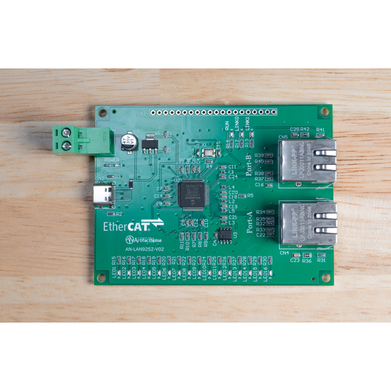
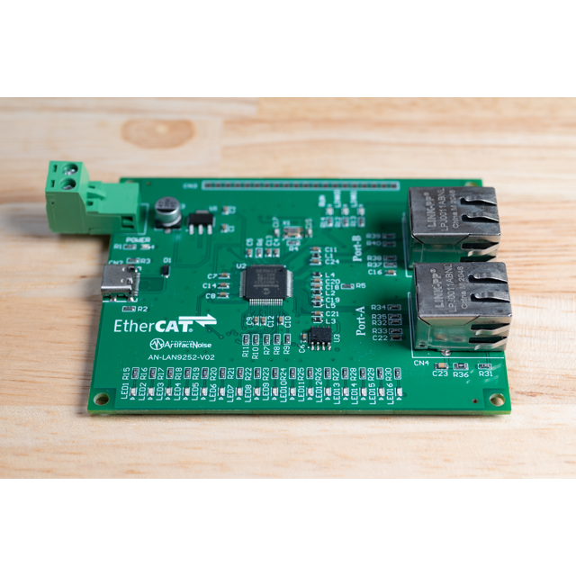
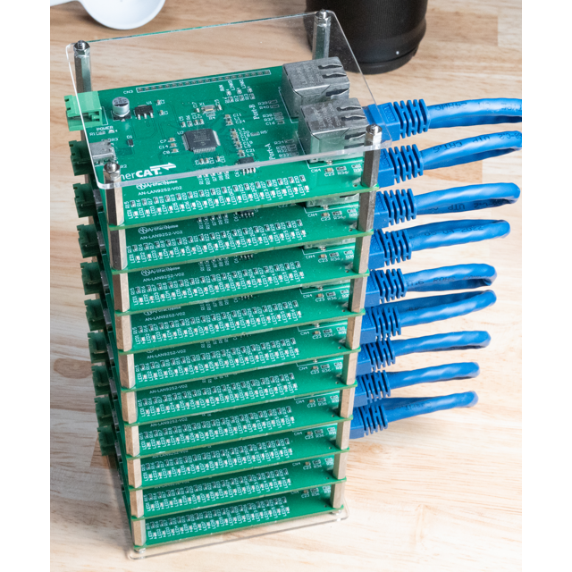

# AN-225 EtherCATスレーブ評価基板

# 商品説明

Microchip社LAN9252を使用したEtherCATスレーブ基板です。

EtherCATの動作を学ぶ上でのトレーニングキットになります。

LAN9252からLED 16個にIOが接続されています。

マスター側からLEDを自在に操作する事が出来ます。

また、未実装のピンコネクタにはSPIを用いてマイコンを繋げる事でオリジナルのEtherCATスレーブを作成する事も出来ます。

## ★基板単体では16個のLEDしか制御できません。機能を拡張する際は、マイコンを使ってSPI通信を行ってください。（ライブラリ準備中）

# 仕様

- 基板サイズ   72mm x 95mm
- USB : Type-C（電源5V供給用）
- パッド：両面スルーホール（1mm穴 2mmパッド）
- 基板厚：1.6mm
- 追加機能：
   - Power用LED 有り
   - RUN/LINK0,1用LED 有り
   - パルストランス内蔵Ethernetコネクタ
   - ET9400　CTTテスト済み

# 内容物 

- 実装済み基板　１枚

# 資料

 - 回路図 & 外形寸法 & 部品表

   

   

# 販売サイト

# トピック

##  10台連結した際の写真

   

##  TwinCATで接続した際の写真

   

##  CTT（EtherCATコンフォーマンステストツール）でテストした際の写真

   
